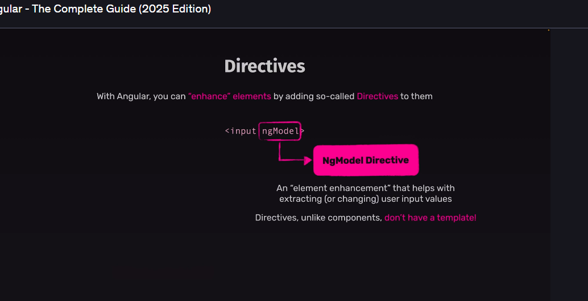

# Angular: Forms & Content Projection

A collection of notes on two-way data binding, form submission, and content projection in Angular.

---

## 1. `[(ngModel)]` and Two-Way Data Binding


In Angular, `[(ngModel)]` is the special syntax for **two-way data binding**. It creates a direct, dynamic link between a property in your component's TypeScript file and an input field in its HTML template.

### 🔁 Think of it like a walkie-talkie:

- When you type into the input field, the value is instantly pushed to the component property.
- When you change the component property’s value in your code, the input field in the UI is instantly updated.

This is achieved by combining:
- Property binding: `[ngModel]` (sends data to the input)
- Event binding: `(ngModelChange)` (listens for input changes)

### ✅ Syntax Example

**new-task.component.ts**
```ts
import { Component } from '@angular/core';
import { FormsModule } from '@angular/forms';

@Component({
  selector: 'app-new-task',
  standalone: true,
  imports: [FormsModule],
})
export class NewTaskComponent {
  enteredTitle = '';
}
```

**new-task.component.html**
```html
<label for="title">Title</label>
<input type="text" id="title" name="title" [(ngModel)]="enteredTitle" />
```

> ℹ️ Note: To use `[(ngModel)]`, you **must import** the `FormsModule` into your component or module.

---

## 2. Handling Form Submission with `(ngSubmit)`

When you import `FormsModule`, Angular **takes control of the `<form>` tag** and prevents the browser’s default behavior (like reloading the page on submit).

### 📝 (ngSubmit)

- This event triggers only when the form is submitted (e.g., clicking a `<button type="submit">`).
- You bind this event to a method in your component to handle form logic.

### ✅ Syntax Example

**form.component.html**
```html
<form (ngSubmit)="onAddTask()">
  <!-- Input fields here -->
  <button type="submit">Add Task</button>
</form>
```

**form.component.ts**
```ts
export class MyComponent {
  onAddTask() {
    console.log('Form submitted!');
  }
}
```

---

## 3. Content Projection with `<ng-content>`

Sometimes you want to create a **wrapper component** (like a styled card) but insert **custom content** into it.

Using `ng-content`, you can **project content** from a parent component into a child’s template.

### 📦 Use Case

Say you have a wrapper component called `<app-card>`.

### ✅ Example

**card.component.html**
```html
<div class="card">
  <ng-content></ng-content>
</div>
```

**app.component.html**
```html
<app-card>
  <h2>Angular Basics</h2>
  <p>This is inside a reusable card!</p>
</app-card>
```

### 🧠 What Happens

Angular inserts the `<h2>` and `<p>` content from `app.component.html` into the `<ng-content>` spot inside the card component.

---